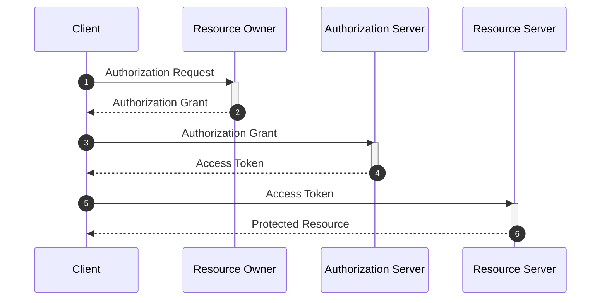
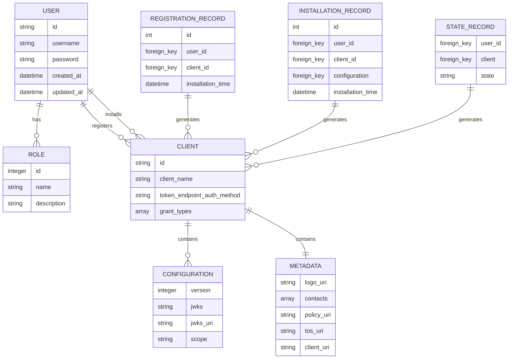

# OAuth 2.1

A Python / Flask implementation of [The OAuth 2.1 Authorization Framework](https://datatracker.ietf.org/doc/html/draft-ietf-oauth-v2-1-08). For demo purposes only.

**Protocol Flow**

The abstract OAuth 2.1 protocol flow and the interaction between the four key roles is summarized by the following sequence diagram.



**Erlaubnis Authorization State Diagram**


**Erlaubnis Database Schema**



## Quickstart

```shell
cd rfc-oauth
poetry install
export FLASK-APP=run.py
flask run
```