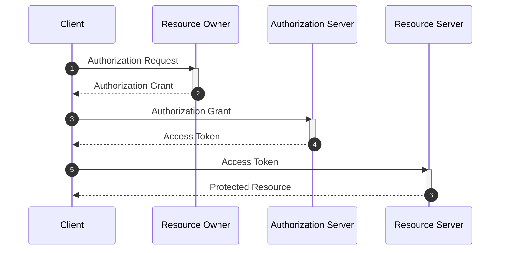
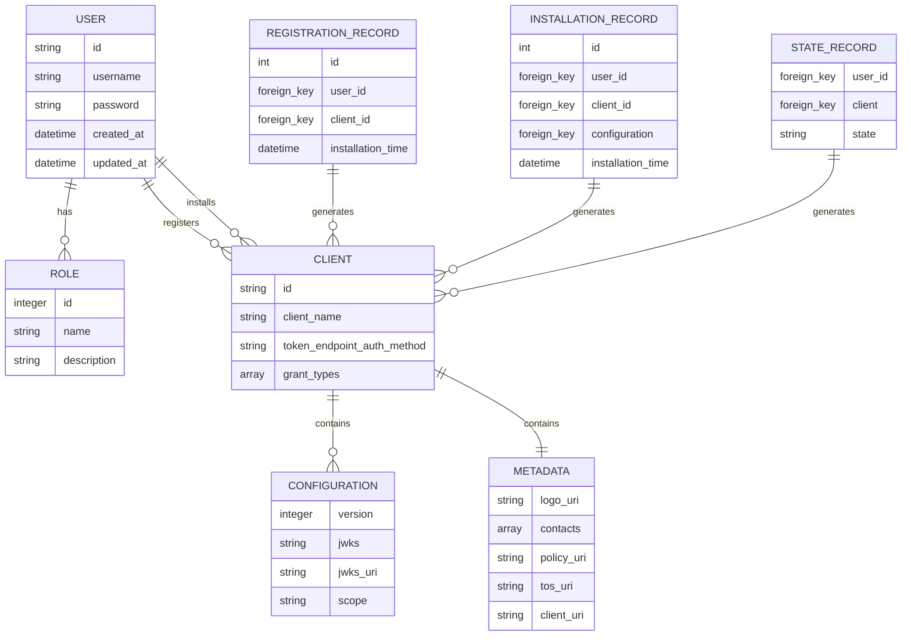

<h1 align="center">erlaubnis</h1>  

<div align="center">  

</div>  
<div align="center">  
<strong>An experimental implementation of the OAuth 2.1 Authorisation Framework.</strong>  
</div>  
<div align="center">  
A small dopamine rabbit hole.  
</div>  

<br />  

<div align="center">  
<!-- Stability -->  
<!-- NPM version -->  
<!-- Build Status -->  
<!-- Test Coverage -->  
<!-- Downloads -->  
<!-- Standard -->  
</div>  

<div align="center">  
<h3>  
<a href="https://example.com">  
Website  
</a>  
<span> | </span>  
<a href="https://github.com/erlaubnis/erlaubnis-handbook">  
Handbook  
</a>  
<span> | </span>  
<a href="https://github.com/choojs/choo/blob/master/.github/CONTRIBUTING.md">  
Contributing  
</a>  
</h3>  
</div>  

<div align="center">  
<sub>The little experiment that could. Built with ❤︎ by  
<a href="https://twitter.com/errbufferoverfl">errbufferoverfl</a>  
</div>  

## Introduction

erlaubnis is a minimal viable OAuth2.1 Authorisation server that experiments with how one can go about implementing the standards, best practices and informational RFCs. It isn't made for production deployment or use.

## Table of contents

- [Introduction](#introduction)
- [Tech Stack](#tech-stack)
- [Roadmap](#roadmap)
- [License](#license)
- [Thank you!](#thank-you)

## Tech Stack

Here's a brief high-level overview of the tech stack erlaubnis uses:

- The project is written in Python & uses the Flask micro web framework.
- For persistent storage (database), the app uses SQLite for local deployments.
- To send emails, the app can be configured to use a local SMTP mailer, or Mailgun.
- Secret hashing is handled by bcrypt.

## Getting Started

<!-- GETTING STARTED -->  

erlaubnis hasn't been built for real world deployment on the Internet.

Set your app's secret key as an environment variable. For example, add the following to your `.bashrc` or `  
.bash_profile::

```shell  
export SECRET='something-really-secret'  
```  

Before running shell commands, set ``FLASK_APP`` and ``FLASK_DEBUG`` environment variables::

```shell  
export FLASK_APP=run.py  
export FLASK_DEBUG=1  
```  

Once the app is loaded various Flask utility functions can be accessed via the `flask` commend:

**Migrations**

When changes are made to the app's models a new migration will need to be run to propogate these changes to the database. Migrations are handled by `flask-migrations` and can be found in the `migrations` directory.

erlaubnis should always ship with a migrations directory, however, in the case it doesn't, or you need to delete it you can reinitialise the directory using:

```shell  
flask db init --package  
``  
  
To create a new migration run:  
  
```shell  
flask db migrate  
```  

To apply the migration to the database run:

```shell  
flask db upgrade  
```  

For those less familiar, the abstract OAuth 2.1 protocol flow and the interaction between the four key roles is summarized by the following sequence diagram.



**Erlaubnis Authorization State Diagram**


**Erlaubnis Database Schema**



## Quickstart

```shell
cd rfc-oauth
poetry install
export FLASK_APP=run.py
flask run
```